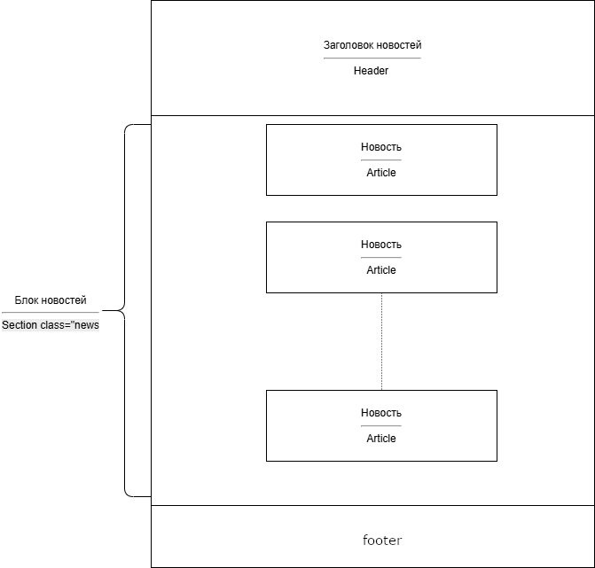
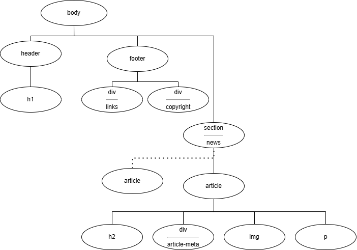

# Проект Новостной сайт города Мусохранск - "Мусохранск24"

## О проекте
Разработан в качестве практического задания на курсе PHPDEV-97 (Профессия Веб-разработчик)

<u> LICENCE: [MIT][def] </u>

[def]: ./license.md "Ccылка"

---

 [Приобретенные знания](new-knowledge.md)

---
[Ссылка на Github Pages](https://ramfour.github.io/CSS_Practice_News_Page/)
---

## Используемые технологии

* HTML

* CSS 

* Web-fonts (Roboto)

## Как открыть/запустить

Зайти в папку сайта в файловом менеджере, кликнуть 2 раза по файлу index.html.

Рисунок 1 Макет сайта

Рисунок 2 Html дом дерево

